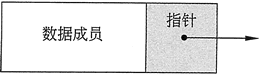

### 链表的结构
链表中的每个结点都包含一个或多个**保存数据的成员**。例如，存储在结点中的数据可以是库存记录；或者它可以是由客户的姓名、地址和电话号码等组成的客户信息记录。

除了数据之外，每个结点还包含一个`后继指针`指向链表中的下一个结点。下图给出了单个结点的组成。



**非空链表的第一个结点称为链表的头**。要访问链表中的结点，需要有一个指向链表头的指针。从链表头开始，可以按照存储在每个结点中的后继指针访问链表中的其余结点。最后一个结点中的后继指针被设置为 `nullptr` 以指示链表的结束。

因为指向链表头的指针用于定位链表的头部，所以也可以认为它代表了链表头。同样的指针也可以用来定位整个链表，从头开始，后面跟着后续指针，所以也可以很自然地把它看作是代表了整个链表。

下图 给出了一个由 3 个结点组成的链表，其中显示了指向头部的指针，链表的 3 个结点以及表示链表末尾的 `nullptr` 指针。


注意，图 2 中绘制的链表结点彼此非常接近，排列整齐。实际上，**链表结点可能散布在内存的各个部分**。


### 链表的C++表示

为了在 C++ 中表示链表，需要有一个表示链表中单个结点的数据类型。通过图 1 可以很自然地发现，这样一个数据类型不但需要包含要存储的数据结构，还要有一个指向另一个相同类型结点的指针。

假设每个结点将存储一个类型为 double 的数据项，则可以声明以下类型来存放结点：
```cpp
struct ListNode
{
    double value;
    ListNode *next;
};
```
在以上代码中，ListNode 就是要存储在链表中的结点的类型，`结构成员` value 是结点的数据部分，而另一个结构成员 next 则被声明为 `ListNode 的指针`，它是指向下一个结点的`后继指针`。

ListNode 结构有一个有趣的属性，它包含一个指向相同类型数据结构的指针，因此可以说是一个包含对自身引用的类型。像这样的类型称为自引用数据类型或自引用数据结构。

**在已经声明了一个数据类型来表示结点之后**，即可定义一个初始为空的链表，方法是定义一个用作链表头的指针并将其初始化为 `nullptr`，示例如下
```cpp
ListNode *head = nullptr;
```

现在可以创建一个链表，其中包含一个结点，存储值为 12.5，如下所示：

```cpp
head = new ListNode; //分配欣新节点
head->value = 12.5;  //存储值
head->next =  nullptr; //表示链表的结尾
```

接下来再看一看**如何创建一个新结点**，在其中存储 13.5 的值，并将其作为链表中的第二个结点。可以使用第二个指针来指向新分配的结点（其中将存储 13.5 的值），示例如下：
```cpp
ListNode *secondPtr = new ListNode;
secondPtr->value = 13.5;
secondPtr->next = nullptr; // 第二个结点是链表的结尾;
head->next  = secondPtr;   //第一个结点指向第二个
```
请注意，以上语句通过将其`后继指针` secondPtr->next 设置为 nullptr，可以**使第二个结点成为链表的结尾**，通过` head->next = secondPtr`; 语句将链表头的`后继指针`改为指向第二个结点。


### 使用构造函数初始化结点


我们知道，C++ 结构体可以有构造函数。对于定义链表结点类型的结构来说，如果能给它提供一个或多个**构造函数**，那将会带来很大的方便，因为这样将使得**结点在创建时即可初始化**。前文还曾经提到过，构造函数可以像常规函数一样，**使用默认形参来定义**，而为结点的`后继指针`提供一个默认的 `nullptr` 形参是很常见的。

以下是 ListNode 结构的另一个定义：
```cpp
struct ListNode 
{
    double value;
    ListNode *next;
    // 构造函数
    ListNode(double value1, ListNode *nextl=nullprt){
        value = value1
        next = next1;
    }
};
```
通过该声明，即可使用以下两种不同的方式创建一个结点：

>* 通过仅指定其 value 部分，而后继指针则默认为 nullptr。

>* 通过指定 value 部分和一个指向链表下一个结点的指针。

通过这个新的结点声明，即可使用比以前的示例要短得多的代码，创建一个存储值 12.5 的结点，而它的后面则是一个存储值 13.5 的结点，示例如下：
```cpp
ListNode *secondPtr = new ListNode(13.5);
ListNode *head = new ListNode(12.5, secondPtr);
```

### 遍历链表
从链表头开始，涉及整个链表，并在每个结点上执行一些处理操作的过程被称为遍历链表。

例如，如果需要打印某个链表中每个结点的内容，则必须遍历该链表。假设某个链表的链表头指针是 numberList，要遍历该链表，则需要使用另一个指针 ptr 指向链表的开头：

下面的一个程序实现了：

读取文件中的数字，将数字排列在链表中，然后通过遍历链表将数字显示在屏幕上。
```cpp
#include <iostream>
#include <fstream>
#include <string>
#include <cstdio>
#include <numeric>
#include <vector>
#include <map>
#include <algorithm>
using namespace std;

struct ListNode
{
    double value;
    ListNode *next;
    // Constructor
    ListNode(double value1, ListNode* next1=nullptr){
        value =value1;
        next = next1;
    }
};


int main(int argc, char const *argv[])
{
    
    double number; //used to read the file
    ListNode *numberList = nullptr;// List of numbers
    // Open the file
    ifstream numberFile("numberFile.dat");
    if(!numberFile)
    {
        cout<<"Error in opening the file of the numbers";
        exit(1);
    }
    // Read the file into a linked list
    cout<<"The contents of the file are: "<<endl;
    while(numberFile>>number)
    {
        cout<<number<<" ";
        // Create a node to hold this number
        // 只有尾结点的后继指针为nullptr
        numberList = new ListNode(number, numberList);
    }
    // Traverse the list while printing
    cout<<endl<<"The contents of the list are: "<<endl;
    ListNode *ptr = numberList;
    while(ptr!=nullptr)
    {
        cout<<ptr->value<<" ";//Process node
        ptr = ptr->next;
    }
    system("pause");
    return 0;
}
// /
// The contents of the file are:
// 10 20 30 40
// The contents of the list are:
// 40 30 20 10 请按任意键继续
```


